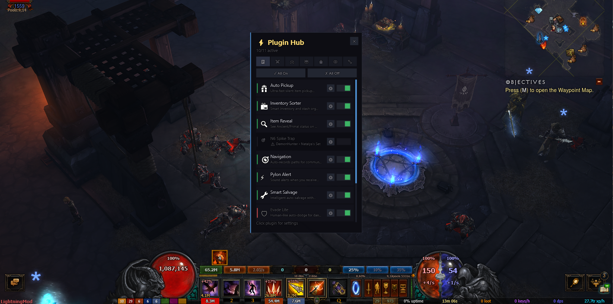
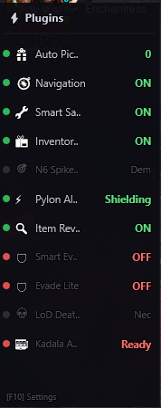
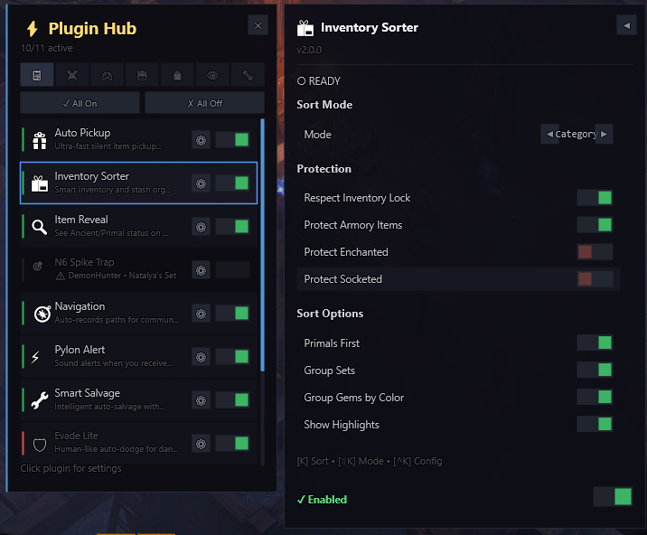
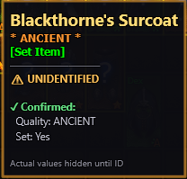

# LightningMOD-P42Collection

<div align="center">



**A premium collection of TurboHUD plugins for Diablo 3**

[](LICENSE)
[]()
[]()

*Enhance your D3 experience with intelligent automation, beautiful UI, and powerful utilities*

---

[Features](#-features) � [Installation](#-installation) � [Plugins](#-plugin-catalog) � [Hotkeys](#-hotkey-reference) � [FAQ](#-faq)

</div>

---

## ? Features

<table>
<tr>
<td width="50%">

### ?? Smart Automation
- **Intelligent pickup** with customizable priorities
- **Auto-salvage** with build protection
- **Kadala gambling** automation
- **Inventory sorting** with multiple modes

</td>
<td width="50%">

### ??? Combat Assistance
- **Smart Evade** - Human-like danger avoidance
- **Class macros** - Optimized skill rotations
- **Pylon alerts** - Never miss a shrine
- **GR Auto-Farm** - Hands-free grinding

</td>
</tr>
<tr>
<td width="50%">

### ??? Enhanced Visuals
- **Item Reveal** - See Ancient/Primal before ID
- **Stat ranges** - Know what can roll
- **Ground highlights** - Important loot visibility
- **Custom UI panels** - Clean, modern interface

</td>
<td width="50%">

### ?? Developer Tools
- **Core Framework** - Unified plugin system
- **Settings persistence** - Auto-save configurations
- **UI Components** - Reusable design library
- **Navigation engine** - Advanced pathfinding

</td>
</tr>
</table>

---

## ?? Screenshots

<div align="center">

| Side Panel UI | Settings Configuration |
|:-------------:|:----------------------:|
|  |  |

| Item Information Window |
|:-----------------------:|
|  |

</div>

---

## ?? Installation

### Quick Install

1. **Download** this repository (Code ? Download ZIP)
2. **Extract** to your TurboHUD folder:
   ```
   TurboHUD/
   ??? plugins/
       ??? Custom/        ? Extract here
           ??? Core/
           ??? AutoPickupSilent/
           ??? SmartEvade/
           ??? ...
   ```
3. **Restart** TurboHUD
4. **Done!** Plugins auto-load and appear in-game

### Manual Install

Copy individual plugin folders to `TurboHUD/plugins/Custom/`

> ?? **Requirement**: The `Core` plugin is recommended for unified settings management

---

## ?? Plugin Catalog

### ?? Tier 1: Essential Plugins

<details>
<summary><b>?? Core Framework</b> � The foundation for all plugins</summary>

#### Overview
The Core plugin provides a unified framework for all custom plugins with shared UI components, settings persistence, and a modern design system.

#### Features
- ?? Central plugin registry with enable/disable
- ?? Automatic settings persistence (JSON)
- ?? Shared UI component library
- ??? Plugin categorization system
- ?? F8 toggle for settings panel

#### Key Benefits
| Feature | Description |
|---------|-------------|
| **Unified UI** | All plugins share consistent styling |
| **Settings Sync** | Changes save automatically |
| **Easy Toggle** | Enable/disable plugins from one panel |
| **Categories** | Combat, Automation, Visual, Utility |

**Location:** `Core/`

</details>

<details>
<summary><b>?? Auto Pickup Silent</b> � Intelligent item collection</summary>

#### Overview
Aggressive auto-pickup that grabs items efficiently without spamming the pickup action.

#### Features
- ? 5 items per frame processing
- ?? 18-yard pickup range
- ?? Priority-based collection
- ?? Silent operation (no spam)

#### Pickup Priority
1. ?? Death's Breath & Crafting Materials
2. ? Legendary Items
3. ?? Gold (optional)
4. ?? Gems (optional)

#### Hotkey
| Key | Action |
|-----|--------|
| `H` | Toggle On/Off |

**Location:** `AutoPickupSilent/`

</details>

<details>
<summary><b>?? Item Reveal</b> � See item quality before identifying</summary>

#### Overview
Reveals Ancient/Primal status and possible stat ranges on unidentified items!

#### What You Can See
| Data | Visibility | Notes |
|------|:----------:|-------|
| Ancient/Primal | ? | Always visible |
| Set Item | ? | Detected |
| Item Type | ? | Full info |
| Stat Ranges | ? | Min-Max values |
| Actual Stats | ? | Server-side |

#### Display Example
```
Dead Man's Legacy
? ANCIENT ?
[Set Item]
????????????????
?? UNIDENTIFIED
????????????????
?? Possible Stats:
  IAS%: 15.0% - 20.0%
  LegPower: 150% - 200%
```

#### Hotkeys
| Key | Action |
|-----|--------|
| `F4` | Toggle Plugin |
| `F5` | Toggle Raw Data |

**Location:** `ItemReveal/`

</details>

---

### ??? Tier 2: Combat & Safety

<details>
<summary><b>?? Smart Evade Lite</b> � Human-like danger avoidance (Recommended)</summary>

#### Overview
A lightweight auto-dodge that helps avoid ground effects with natural, human-like reactions.

#### How It Works
```
1. Detection ? Only triggers when INSIDE danger
2. Delay    ? Random 1.25-2 second reaction time
3. Action   ? Single escape movement
4. Cooldown ? 3 second wait before next evade
```

#### Danger Types Detected
| Affix | Priority | Icon |
|-------|:--------:|:----:|
| Frozen | ?? High | ?? |
| Molten Explosion | ?? High | ?? |
| Arcane | ?? High | ?? |
| Thunderstorm | ?? High | ? |
| Desecrator | ?? Normal | ?? |
| Plagued | ?? Normal | ?? |
| Frozen Pulse | ?? Normal | ?? |

#### Hotkey
| Key | Action |
|-----|--------|
| `J` | Toggle On/Off |

**Location:** `SmartEvadeLite/`

</details>

<details>
<summary><b>? Smart Evade (Full)</b> � Advanced protection system</summary>

#### Overview
Full-featured auto-evade with wall awareness, preemptive dodging, and intelligent pathing.

#### Features
- ?? Wall collision detection
- ?? Predictive danger avoidance
- ??? Smart path finding
- ?? Highly configurable

#### Hotkey
| Key | Action |
|-----|--------|
| `Shift+J` | Toggle On/Off |

> ?? **Note**: More aggressive than Lite version

**Location:** `SmartEvade/`

</details>

<details>
<summary><b>? Pylon Alert</b> � Never miss a pylon again</summary>

#### Overview
Visual and audio alerts when pylons appear in Greater Rifts.

#### Pylon Types
| Pylon | Alert Color | Priority |
|-------|:-----------:|:--------:|
| Power | ?? Red | High |
| Conduit | ?? Blue | High |
| Channeling | ?? Purple | Medium |
| Shield | ?? Yellow | Medium |
| Speed | ?? Green | Medium |

**Location:** `PylonAlert/`

</details>

---

### ?? Tier 3: Class Macros

<details>
<summary><b>?? Wizard Star Pact Macro</b> � Meteor Shower automation</summary>

#### Overview
Automates the complex Star Pact Wizard rotation for Challenge Rifts.

#### Rotation
```
1. Channel Arcane Torrent (build stacks)
2. Release at max stacks
3. Cast Meteor Shower
4. Repeat
```

#### Hotkey
| Key | Action |
|-----|--------|
| `F1` | Toggle Macro |

**Location:** `WizardStarPactMacro/`

</details>

<details>
<summary><b>?? LoD Death Nova Macro</b> � Necromancer automation</summary>

#### Overview
Handles the Death Nova Necromancer rotation efficiently.

**Location:** `LoDDeathNovaMacro/`

</details>

<details>
<summary><b>?? Natalya Spike Trap Macro</b> � Demon Hunter automation</summary>

#### Overview
Automates Natalya's set Spike Trap placement and detonation.

**Location:** `NatalyaSpikeTrapMacro/`

</details>

---

### ?? Tier 4: Inventory Management

<details>
<summary><b>?? Inventory Sorter</b> � Organize your bags instantly</summary>

#### Overview
Multiple sorting algorithms to keep your inventory organized.

#### Sort Modes
| Mode | Description |
|------|-------------|
| **Type** | Group by item type |
| **Quality** | Primals ? Ancients ? Normal |
| **Slot** | By equipment slot |
| **Smart** | Combination of all |

#### Hotkeys
| Key | Action |
|-----|--------|
| `K` | Sort Inventory |
| `Shift+K` | Change Sort Mode |

**Location:** `InventorySorter/`

</details>

<details>
<summary><b>?? Smart Salvage</b> � Intelligent item recycling</summary>

#### Overview
Auto-salvage with build protection - never accidentally destroy your needed items!

#### Features
- ?? Pre-configured build blacklists
- ?? Import from Maxroll.gg URLs
- ??? Protects Ancients & Primals
- ?? Socket protection

#### Protection Levels
| Protection | Saved |
|------------|:-----:|
| Primal Items | ? |
| Ancient Items | ? (configurable) |
| Socketed Items | ? |
| Blacklisted Items | ? |

#### Hotkey
| Key | Action |
|-----|--------|
| `U` | Start Auto-Salvage |

**Location:** `SmartSalvage/`

</details>

<details>
<summary><b>?? Kadala Auto Buy</b> � Automated gambling</summary>

#### Overview
Automates Blood Shard spending at Kadala with smart item selection.

#### Features
- ?? Target specific item slots
- ?? Track gambling statistics
- ?? Auto-stop conditions

**Location:** `KadalaAutoBuy/`

</details>

---

### ?? Tier 5: Advanced Automation

<details>
<summary><b>?? Auto Farm (GR)</b> � Greater Rift automation</summary>

#### Overview
Automated Greater Rift farming with intelligent decision making.

#### States
```
IDLE ? ENTER_GR ? CLEAR_RIFT ? KILL_RG ? UPGRADE_GEM ? CLOSE_RIFT
```

#### Features
- ?? Smart mob targeting
- ?? Auto gem upgrading
- ?? Continuous rift loops
- ?? Configurable GR levels

**Location:** `AutoFarm/`

</details>

<details>
<summary><b>??? Navigation Engine</b> � Advanced pathfinding</summary>

#### Overview
Sophisticated navigation system with A* pathfinding and spatial awareness.

#### Components
| Component | Purpose |
|-----------|---------|
| `NavGrid` | Grid-based collision |
| `AStarPathfinder` | Optimal path finding |
| `NavMesh` | Terrain analysis |
| `SpatialEngine` | Environment awareness |

**Location:** `Navigation/`

</details>

<details>
<summary><b>?? Enhanced Navigation</b> � Waypoint system</summary>

#### Overview
Waypoint-based navigation with preset routes.

**Location:** `EnhancedNavigation/`

</details>

---

### ?? Tier 6: Utilities

<details>
<summary><b>?? Custom Plugin Config Panel</b> � Settings UI</summary>

#### Overview
In-game configuration panel for all custom plugins.

**Location:** `CustomPluginConfigPanel/`

</details>

<details>
<summary><b>?? Auto Master</b> � Legacy automation (Deprecated)</summary>

#### Overview
Legacy auto-pickup system. Replaced by **Auto Pickup Silent**.

> ?? **Status**: DEPRECATED - Use AutoPickupSilent instead

**Location:** `AutoMaster/`

</details>

---

## ?? Hotkey Reference

### Quick Reference Card

| Key | Action | Plugin |
|:---:|--------|--------|
| `F1` | Toggle Star Pact Macro | WizardStarPactMacro |
| `F4` | Toggle Item Reveal | ItemReveal |
| `F5` | Toggle Raw Data Mode | ItemReveal |
| `F8` | Open Settings Panel | Core |
| `H` | Toggle Auto Pickup | AutoPickupSilent |
| `J` | Toggle Evade Lite | SmartEvadeLite |
| `Shift+J` | Toggle Full Evade | SmartEvade |
| `K` | Sort Inventory | InventorySorter |
| `Shift+K` | Change Sort Mode | InventorySorter |
| `U` | Start Auto-Salvage | SmartSalvage |

---

## ?? UI Layout Reference

### Left Side Panel Positions

```
???????????????????????
?    Y = 0.28         ? ? Smart Evade
?    Y = 0.35         ? ? (reserved)
?    Y = 0.42         ? ? Auto Master
?    Y = 0.49         ? ? Evade Lite
?    Y = 0.56         ? ? Inventory Sort
?    Y = 0.63         ? ? Auto Pickup
???????????????????????
```

---

## ?? Recommended Setups

### ? Speed Farming Build
*For T16, Bounties, Normal Rifts*

| Plugin | Purpose |
|--------|---------|
| ? Auto Pickup Silent | Fast looting |
| ? Smart Evade Lite | Basic safety |
| ? Inventory Sorter | Quick organization |

### ?? Greater Rift Push
*For high GR progression*

| Plugin | Purpose |
|--------|---------|
| ? Smart Evade (Full) | Maximum safety |
| ? Pylon Alert | Shrine timing |
| ? Item Reveal | Quick ID priority |

### ?? AFK Farming
*For hands-free grinding*

| Plugin | Purpose |
|--------|---------|
| ? Auto Farm | GR automation |
| ? Auto Pickup Silent | Collect everything |
| ? Smart Salvage | Clean inventory |
| ? Smart Evade (Full) | Stay alive |

### ?? Challenge Rift (Wizard)
*For weekly chest*

| Plugin | Purpose |
|--------|---------|
| ? Wizard Star Pact Macro | Optimal rotation |

---

## ?? File Structure

```
TurboHUD/
??? plugins/
    ??? Custom/
        ??? ?? Core/                    # Framework
        ?   ??? CorePlugin.cs
        ?   ??? UIComponents.cs
        ?   ??? CustomPluginBase.cs
        ?
        ??? ?? AutoPickupSilent/        # Item collection
        ??? ?? ItemReveal/              # Item analysis
        ??? ?? SmartEvade/              # Full evade
        ??? ?? SmartEvadeLite/          # Lite evade
        ??? ?? InventorySorter/         # Bag sorting
        ??? ?? SmartSalvage/            # Auto salvage
        ??? ?? KadalaAutoBuy/           # Gambling
        ??? ?? PylonAlert/              # Shrine alerts
        ?
        ??? ?? WizardStarPactMacro/     # Wizard macro
        ??? ?? LoDDeathNovaMacro/       # Necro macro
        ??? ?? NatalyaSpikeTrapMacro/   # DH macro
        ?
        ??? ?? AutoFarm/                # GR automation
        ??? ?? Navigation/              # Pathfinding
        ??? ?? EnhancedNavigation/      # Waypoints
        ?
        ??? ?? .assets/                 # Images
            ??? main_image.png
            ??? settings_gui.png
            ??? sidepanel_ui.png
            ??? iteminfo_window.png
```

---

## ? FAQ

<details>
<summary><b>How do I disable a plugin?</b></summary>

Press `F8` to open the Core settings panel, then click the toggle next to the plugin you want to disable.

</details>

<details>
<summary><b>Are these plugins safe to use?</b></summary>

These plugins are for personal use. As with any third-party tool, use at your own discretion.

</details>

<details>
<summary><b>Why isn't Item Reveal showing actual stat values?</b></summary>

Diablo 3 uses server-side stat rolling. The actual values are determined when you identify the item. We can only show the possible ranges.

</details>

<details>
<summary><b>Can I use Smart Evade in hardcore?</b></summary>

Smart Evade Lite is recommended for HC as it has intentional delays. Full Smart Evade is more aggressive but may be seen as too automated.

</details>

<details>
<summary><b>How do I import a Maxroll build to Smart Salvage?</b></summary>

Copy the Maxroll.gg build URL, open Smart Salvage settings, and paste it in the import field. Items from the build will be added to your blacklist.

</details>

---

## ?? Changelog

### 2026-01-04
- ?? Added all custom plugins to community repository
- ?? Created comprehensive documentation
- ??? Added screenshots and visual guides
- ?? Updated Smart Evade with wall awareness

### 2025-12-31
- ? AutoPickupSilent: Made aggressive (5 items/frame)
- ?? WizardStarPactMacro: Created for Challenge Rift

### 2025-12-30
- ?? Initial release of plugin collection

---

## ?? Contributing

Found a bug? Have a suggestion? 

1. Open an issue describing the problem
2. Fork the repository
3. Create your feature branch
4. Submit a pull request

---

## ?? License

This project is licensed under the MIT License - see the [LICENSE](LICENSE) file for details.

---

<div align="center">

**Made with ?? for the Diablo 3 community**

*Happy farming, Nephalem!* ??

---

[](https://github.com/push42)

</div>